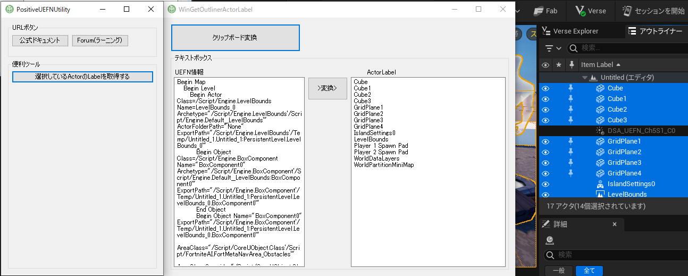
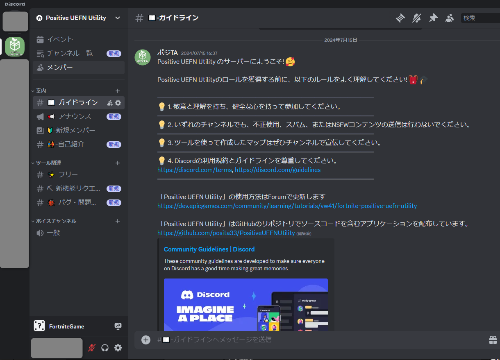
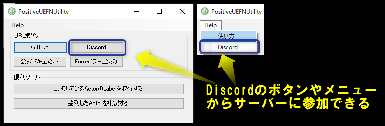

# Positive UEFN Utility

This is a tool that uses text information obtained from UEFN.

## Install ".NET Framework 4.7.2 Runtime"

"Positive UEFN Utility" is developed with ".NET Framework 4.7.2".
It will not start unless ".NET Framework 4.7.2" is installed. Please install ".NET Framework 4.7.2 Runtime".

[.NET Framework 4.7.2 のダウンロード](https://dotnet.microsoft.com/en-us/download/dotnet-framework/net472)

## Check the Epic Forum page for instructions on how to use it.

The owner has created a usage page on the forum and will try update the usage page from time to time.

[Forum page on how to use the Positive UEFN Utility](https://dev.epicgames.com/community/learning/tutorials/vw41/fortnite-positive-uefn-utility)

## Discord server for enquiries

0.2.0 is the version for enlisting reports from, other versions may or may not be considered.

You can now also make "feature requests" and "bug/problem reports" on [Discord](https://discord.gg/WHv8egZnhy).

When you join the server, please check the "Guidelines" channel.

You can join the Discord server from the tool using the Discord button.

